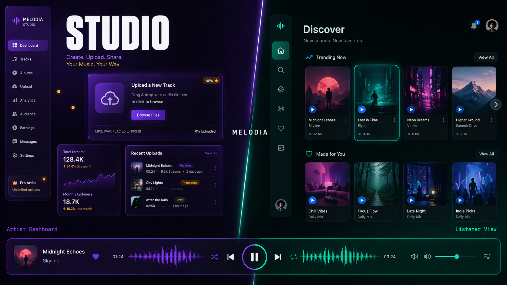
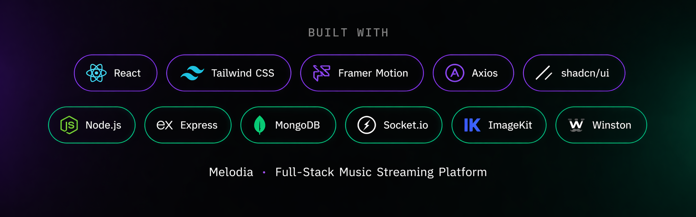
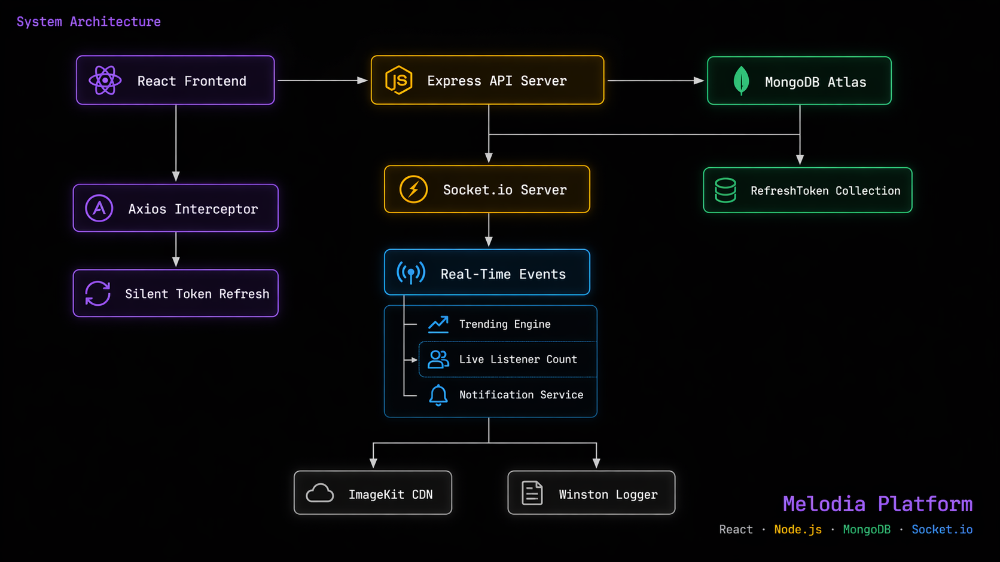
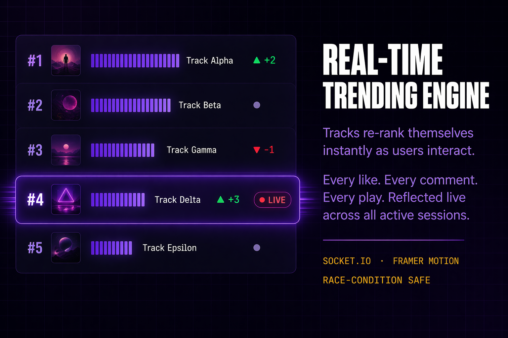
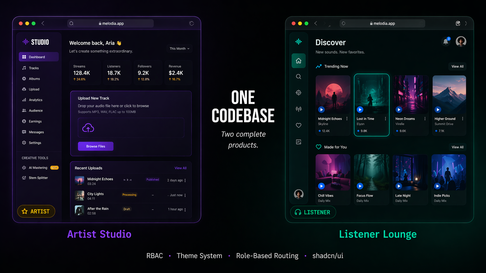
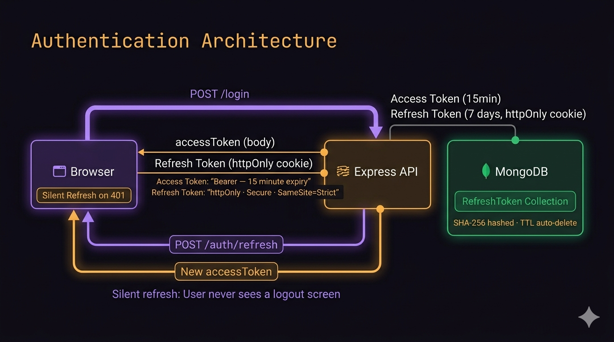

# Melodia — Real-Time Music Streaming Platform

A full-stack music streaming platform built on the MERN stack with real-time capabilities via Socket.io. Artists upload and manage their music. Listeners discover and stream it. Both roles are served completely different interfaces from a single codebase.




---

## What It Does

- **Real-Time Leaderboard**: Tracks re-rank themselves on a live leaderboard as users like and comment — animated in real time across every active session simultaneously.
- **Live Listener Counter**: Per track synchronization via WebSockets.
- **Dual-Interface System**: Artists and listeners see completely different applications — different color systems, sidebar behavior, typography, and feature sets — enforced through a role-based theme engine and RBAC middleware.
- **Notification Engine**: Real-time alerts for likes, comments, and new releases.
- **Secure Auth**: JWT dual-token auth with silent refresh — users are never forced to log in again mid-session.

---

## Tech Stack



**Frontend**
- React 18 + Vite
- React Router DOM v6
- Tailwind CSS + shadcn/ui
- Framer Motion
- Axios (with silent token refresh interceptor)
- React Hook Form + Zod
- Socket.io Client
- Sonner (toast notifications)
- Lucide React

**Backend**
- Node.js + Express
- MongoDB + Mongoose
- Socket.io
- JWT (access + refresh token system)
- Winston (structured logging with daily rotation)
- ImageKit (media storage)
- music-metadata
- bcryptjs
- cookie-parser
- express-rate-limit
- helmet

---

## Architecture



```
┌─────────────────┐     REST + WS      ┌──────────────────┐
│  React Frontend │ ─────────────────► │  Express Server  │
│  (Netlify)      │                    │  (Railway)       │
│                 │ ◄───────────────── │                  │
│  Axios          │   JSON + Cookies   │  Socket.io       │
│  Interceptor    │                    │  REST API        │
│  Socket.io      │                    │  Auth Middleware  │
└─────────────────┘                    └────────┬─────────┘
                                                │
                          ┌─────────────────────┼──────────────────┐
                          │                     │                  │
                   ┌──────▼──────┐    ┌─────────▼──────┐  ┌───────▼──────┐
                   │  MongoDB    │    │   ImageKit     │  │   Winston    │
                   │  Atlas      │    │   CDN          │  │   Logger     │
                   │             │    │                │  │              │
                   │  Users      │    │  Audio Files   │  │  combined/   │
                   │  Music      │    │  Cover Images  │  │  errors/     │
                   │  Albums     │    │                │  │  http/       │
                   │  Tokens     │    └────────────────┘  └──────────────┘
                   └─────────────┘
```

---

## Key Features In Depth

### Real-Time Trending Engine

Tracks re-rank on a live leaderboard as users interact. Socket.io broadcasts ranking updates to every connected client simultaneously. Framer Motion handles the position transitions so the movement is smooth rather than a jerky DOM swap.

### Dual Role System

Two completely separate UI personalities from one React codebase. Role is determined at login and stored in AuthContext. ThemeContext reads the role and injects CSS variable overrides directly onto the `<html>` element.

| | Artist | Listener |
|---|---|---|
| Theme | Dark violet `#0D0A14` | Dark teal `#080F0F` |
| Accent | Amber `#F59E0B` | Sky `#38BDF8` |
| Sidebar | 260px expanded, labeled | 72px icon-only rail |
| Typography | `font-black` tight tracking | `font-semibold` wide tracking |
| Extra routes | Upload, Create Album, Analytics | — |
| Player extras | Edit metadata, waveform viz | Like, Queue |

### JWT Authentication Flow

```
Login → Access Token (15min, response body)
      + Refresh Token (7 days, httpOnly cookie, SHA-256 hashed in MongoDB)

401 received → Axios interceptor fires POST /auth/refresh silently
             → New access token issued, old refresh token deleted (rotation)
             → Original request retried with new token
             → User sees nothing
```

---

## Getting Started

### Prerequisites
- Node.js 18+
- MongoDB Atlas account
- ImageKit account

### Setup
1. **Clone & Install**:
   ```bash
   git clone https://github.com/yourusername/melodia.git
   cd melodia
   npm install && cd frontend && npm install
   ```
2. **Environment Variables**:
   Create `.env` in root and `frontend/.env.local` based on the reference below.
3. **Run**:
   ```bash
   # Root
   npm run dev
   # Frontend
   cd frontend && npm run dev
   ```

---

## Deployment

### Backend → Railway
1. Push to GitHub.
2. Create Railway project from repo.
3. Set environment variables (with `NODE_ENV=production`).

### Frontend → Netlify
1. Push to GitHub.
2. Create Netlify site from repo (Base: `frontend`, Build: `npm run build`, Publish: `dist`).
3. Set `VITE_API_BASE_URL` to your Railway URL.

---

## API Reference

### Auth
| Method | Endpoint | Auth | Description |
|---|---|---|---|
| POST | `/api/auth/register` | None | Create account |
| POST | `/api/auth/login` | None | Login, returns tokens |
| POST | `/api/auth/refresh` | Cookie | Rotate refresh token |
| POST | `/api/auth/logout` | Bearer | Invalidate refresh token |

### Music
| Method | Endpoint | Auth | Description |
|---|---|---|---|
| GET | `/api/music` | Bearer | Get all tracks |
| POST | `/api/music/upload` | Artist | Upload a track |
| GET | `/api/music/albums` | Bearer | Get all albums |

---

## Author

**Waleed Shahid**
[GitHub](https://github.com/W-Bjwa04)

> Built as a portfolio project to demonstrate production-grade full-stack engineering — real-time architecture, security patterns, and role-based system design.
# Melodia-Real-Time-Music-Streaming-Platform
